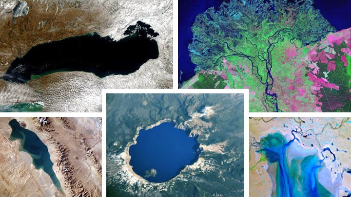

# Global Lake Level Database

The **Global Lake Level Database (GLLD)** is the back-end architecture for the Python package [LakePy](https://github.com/ESIPFed/LakePy).
The GLLD hosts historic lake level data on an Amazon Web Services (AWS) Relational Database Service (RDS). Currently the
 GLLD data comes from three sources (so far!)

 - [United States Geological Survey National Water Information System](https://waterdata.usgs.gov/nwis)
 - [United States Department of Agriculture: Foriegn Agricultural Service's G-REALM Database](https://ipad.fas.usda.gov/cropexplorer/global_reservoir/)
 - [Theia's HydroWeb Database](http://hydroweb.theia-land.fr/)

**Funding for this work comes from the Earth Science Information Partners (ESIP) Winter 2020 Grant**

_See the funded proposal [here](https://www.esipfed.org/wp-content/uploads/2020/04/Gearon.pdf)_

## The Basics

The GLLD consists of two tables:
- reference_ID
- lake_water_level

The *reference_ID* table contains the **Unique ID Number, Lake Name, Original Source, and Metadata**, of all lakes.
The **Unique ID Number** is assigned incrementally as new lakes are added to the GLLD. This is the *primary key* for the MySQL table. This number is what is primarly used to identify
and reference lakes in the GLLD and LakePy. If the same lake exists from multiple sources, there will be two lakes with a unique ID.
For example, Lake Mead exists in both the hydroweb data and the USGS data. As shown below, both copies are retained and treated as unique entries.

|    |   id_No | source   | lake_name                           |
|---:|--------:|:---------|:------------------------------------|
|  0 |     138 | hydroweb | Mead                                |
|  1 |    1556 | usgs     | MEAD LAKE WEST BAY NEAR WILLARD, WI |

The **lake name** is copied exactly as is from the original data source. The **source** identifies which of the three original data sources
the data comes from. Finally the **metadata** stores all available metadata from the data source as a JSON array.

The **lake_water_level** table contains the actual historic data for each lake. This table uses a *composite primary key* 
of the **Unique ID Number** and **date (YYYY-MM-DD)** for the MYSQL table. This method of a composite primary key limits the GLLD to have a maximum resolution of
one unique lake measurement per day for each lake.

## Functionality
The GLLD is regularly updated for new data (both the addition of new lakes, and the addition of new lake level data for existing lakes). 
The precise way we interact with each of the original sources varies from source to source, but the logic of these interactions is consistent across all sources.
This occurs in three steps for each of the two tables:
- Read
- Verify
- Commit

for the **Reference_ID** table, we point to summary product tables from each of the original data sources. Lake names are *read* in, and the
associated metadata is packaged as a JSON object. These are then *verified* against the existing GLLD. New lakes are assigned
a **Unique ID Number** and *committed* to the GLLD. Already existing Lakes are dropped to ensure no duplication of products within the GLLD.

The **lake_water_level** table operates similarly. The actual lake level data for each lake is *read* in and parsed to contain the data and lake level measurment.
Each record is *verified* against the existing table, and all new data entries are *committed* to the GLLD. 

## Software Used
**Built with:**
- [Python](https://www.python.org/)
  - [Pandas](https://pandas.pydata.org/)
  - [PyMySQL](https://pymysql.readthedocs.io/en/latest/)
  - [SQLAlchemy](https://www.sqlalchemy.org/)
- [Amazon MySQL RDS](https://aws.amazon.com/rds/mysql/)

## Credits
This work is based on funding provided by the ESIP Lab with support from the National Aeronautics and Space
Administration (NASA), National Oceanic and Atmospheric Administration (NOAA) and the United States Geologic
Survey (USGS). 
  
The authors would also like to acknowledge the Dynamic
Stratigraphy Group at UT Austin and the AWS
Staff that helped on this project!

## License

Creative Commons © [James Hooker Gearon & John Franey](https://github.com/ESIPFed/GlobalLakeLevelDatabase/blob/master/LICENSE)
